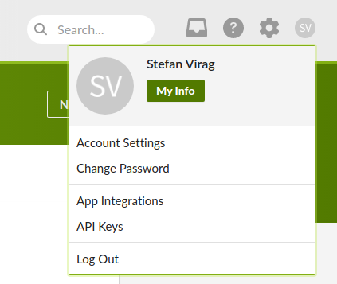
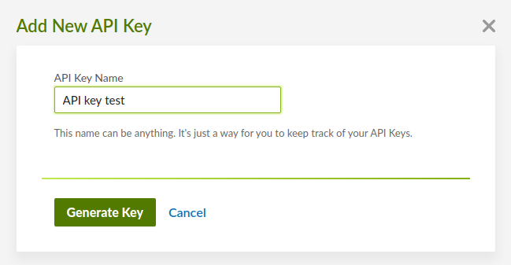

# Development

This integration focuses on [BambooHR](https://www.bamboohr.com/) and is using
[BambooHR REST API](https://documentation.bamboohr.com/reference) for
interacting with the BambooHR platform.

[BambooHR Getting Started](https://documentation.bamboohr.com/docs/getting-started)
section can also be useful.

## Provider account setup

To set up a BambooHR account, please follow these steps:

1. Visit the [BambooHR Sign Up](https://www.bamboohr.com/signup/) page, enter
   the necessary form details and submit the form/follow through with the
   procedure. The form is organizated into 2 pages, one asking for your user
   details while the next page asks for company related info.
2. Once done, you will be redirected to the dashboard as well as receive an
   email regarding your sign up.

## Authentication

1. Once logged in, click on your profile in the top right section.



2. Next you need to click on "API Keys" item.

3. You'll be taken to the "My API Keys" page where you can create a new API key
   by clicking on the "Add New Key" button.


4. After completing the previous step you'll see a modal that asks you to input
   the API key name. After entering your desired name press "Generate key".



5. A new modal will appear containing the access token. It is shown only once,
   so make sure to save it somewhere or you'll need to re-create it again later.

6. Copy the API Key, create a .env file at the root of this project, and set the
   CLIENT_ACCESS_TOKEN variable with the copied value.

```bash
CLIENT_ACCESS_TOKEN="paste the access token value here"
```

6. The final step is to include the hostname in the `.env` file. Put the host
   part of the URL that your dashboard (and organization) is pointed at
   (https://[this part].bamboohr.com).

```bash
CLIENT_ACCESS_TOKEN="paste the access token value here"
CLIENT_NAMESPACE="your organization name"
```

After following the above steps, you should now be able to start contributing to
this integration. The integration will pull in the `CLIENT_ACCESS_TOKEN` and
`CLIENT_NAMESPACE` variables from the `.env` file and use them when making
requests.

## Testing API Calls

```sh
export BAMBOOHR_DOMAIN=domekipper
export BAMBOOHR_API_KEY=1a786...
export BAMBOOHR_EMPLOYEE_ID=61
export BAMBOOHR_EMPLOYEE_REPORT_PATH=/tmp/employee-report.json

cat > $BAMBOOHR_EMPLOYEE_REPORT_PATH<< EOF
{
    "title": "Employee Report for JupiterOne",
    "filters": {},
    "fields": [
      "displayName",
      "firstName",
      "lastName",
      "preferredName",
      "jobTitle",
      "workPhone",
      "mobilePhone",
      "workEmail",
      "department",
      "location",
      "division",
      "linkedIn",
      "instagram",
      "pronouns",
      "workPhoneExtension",
      "supervisor",
      "photoUploaded",
      "photoUrl",
      "canUploadPhoto",
      "employmentHistoryStatus",
      "terminationDate",
      "hireDate"
    ]
}
EOF
```

```sh
curl -i -u "${BAMBOOHR_API_KEY}:x" "https://api.bamboohr.com/api/gateway.php/${BAMBOOHR_DOMAIN}/v1/employees/directory"
curl -i -u "${BAMBOOHR_API_KEY}:x" "https://api.bamboohr.com/api/gateway.php/${BAMBOOHR_DOMAIN}/v1/employees/${BAMBOOHR_EMPLOYEE_ID}/?fields=status"
curl -i -u "${BAMBOOHR_API_KEY}:x" "https://api.bamboohr.com/api/gateway.php/${BAMBOOHR_DOMAIN}/v1/meta/fields/"
curl -i -u "${BAMBOOHR_API_KEY}:x" -H "Content-Type: application/json" --data "@${BAMBOOHR_EMPLOYEE_REPORT_PATH}" "https://api.bamboohr.com/api/gateway.php/${BAMBOOHR_DOMAIN}/v1/reports/custom?format=json&onlyCurrent=false"
```
